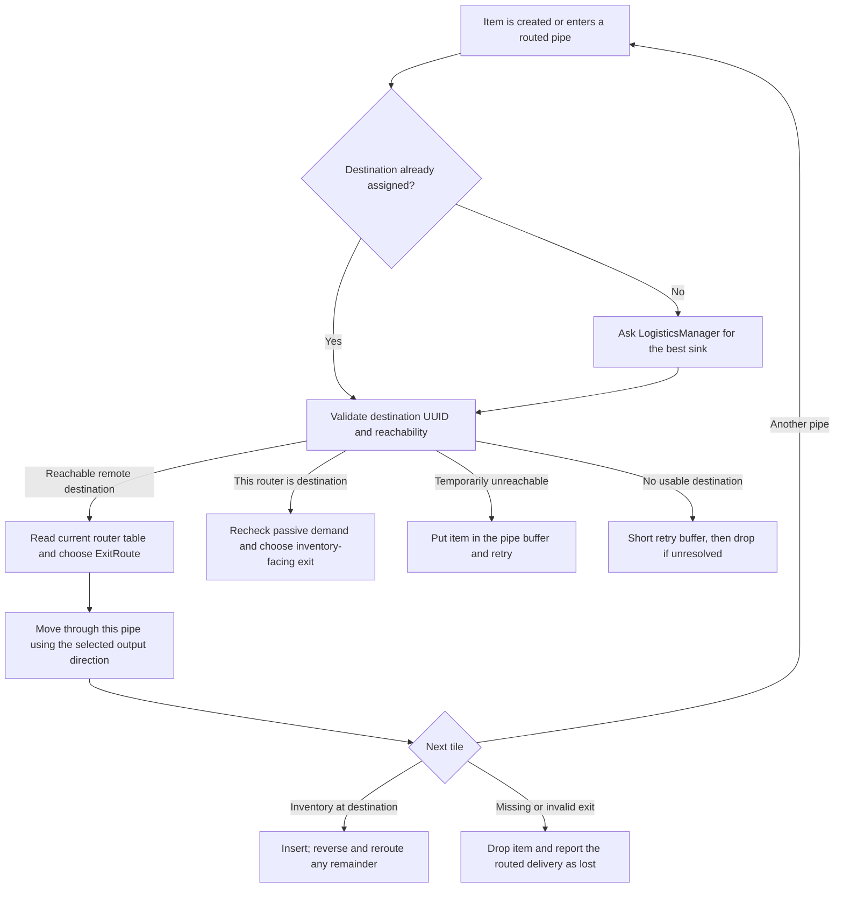

# Item Routing Through Pipes

This document describes the server-side item-routing implementation in this repository. Here, a "traveling packet"
means an `LPTravelingItemServer`: an item stack plus its movement state and `ItemRoutingInformation`. Client network
packets are covered separately below.

## Short version

Logistics Pipes does not attach a complete, immutable path to an item.

1. Every routed pipe maintains a topology-derived routing table.
2. An item is assigned a destination router, either before it is sent or when it first enters a routed pipe without a
   destination.
3. At each routed pipe, the route layer looks up the current best usable `ExitRoute` to that destination and stores only
   the next output direction on the traveling item.
4. The item keeps its destination while moving. If that destination becomes unreachable or rejects a passive item, the
   item can be buffered and/or assigned a different destination.

Consequently, "choosing the destination" and "choosing the next hop" are separate decisions. The destination normally
survives many hops; the next hop is recalculated at every routed pipe.

## 1. How the routing tables are built

Each `CoreRoutedPipe` owns an `IRouter`, normally a `ServerRouter`. A router has two identities:

- a runtime integer `simpleID`, used for array/bit-set indexing and most hot-path lookups;
- a UUID, used as the stable destination identity carried by items and saved to NBT.

### Discovering neighboring routers

`ServerRouter.recheckAdjacent()` runs a bounded `PathFinder` search from the routed pipe. The search walks ordinary LP
pipes and supported external/special connections until it reaches another routed pipe. This creates graph edges between
routed pipes even when several unrouted transport pipes lie between them.

An edge records:

- its first physical `exitOrientation`;
- weighted distance and physical block distance;
- directional capabilities (`canRouteTo`, `canRequestFrom`, and the two power flags);
- firewall filters accumulated along the connection.

Network-divider pipes stop discovery. One-way and power-only pipes remove capabilities in the affected direction.
Security boundaries can remove an adjacency, and special/direct connections can add distance or resistance. The search
is bounded by `LOGISTICS_DETECTION_COUNT` and `LOGISTICS_DETECTION_LENGTH`; too many unrouted connections on one side are
also rejected by `MAX_UNROUTED_CONNECTIONS`.

### Link-state database and shortest paths

When adjacency changes, the router publishes its neighbor metrics and filters into the shared link-state database and
increments the routing version across the connected network. `ServerRouter.CreateRouteTable()` then runs Dijkstra's
algorithm over that database.

The resulting routing table is indexed by destination `simpleID`. Each entry may contain more than one `ExitRoute`,
because routes with different connection flags or filter chains remain useful alternatives. An `ExitRoute` identifies
the destination, first-hop direction, total weighted distance, block distance, allowed capabilities, and filters.

The table may be rebuilt by `RoutingTableUpdateThread`. Calls such as `hasRoute()`, `getExitFor()`, and
`getDistanceTo()` call `ensureRouteTableIsUpToDate(true)`, so a decision that needs the table forces it current when
necessary. Pipe/tile change listeners mark adjacency dirty; normal router ticks also perform periodic full refreshes.

## 2. When an item's destination is decided

There are three main entry paths.

### Destination chosen before extraction or sending

Passive senders such as extractor and quick-sort modules call `hasDestination()` before removing an item from an
inventory. They receive a destination plus a `SinkReply`, limit the extracted count when necessary, then call
`sendStack()`. This avoids extracting an item for which no sink currently exists.

Request/provider/crafting flows usually already know the requester. They call the explicit-destination overload of
`sendStack()`, which marks the item `Active` and stores that router immediately.

### Destination chosen on entry

An unaddressed item can enter a routed pipe with `destinationint == -1`. `RouteLayer.getOrientationForItem()` then calls
`LogisticsManager.assignDestinationFor()` using the current pipe as the source. This is the normal fallback for items
injected from generic or external transport.

Special connections that temporarily turn a routed item into an ordinary external item queue its
`ItemRoutingInformation` at the receiving routed pipe. `resolveRoutedDestination()` matches that queued information by
item type and count before doing normal routing.

### Destination changed during recovery

The route layer invokes `assignDestinationFor()` again when the old destination has no usable route, when an item marked
`arrived` loops back into routing, or when a passive/default destination says it no longer wants the item. Reassignment
clears the old destination, adds it to the item's jam list, and searches from the current router.

## 3. How a sink is selected

`LogisticsManager.assignDestinationFor()` performs destination selection as follows:

1. Clear the previous destination while retaining the jam list and buffer counter.
2. Query `ServerRouter.getRoutersInterestedIn(item)` to obtain specific and generic sink candidates. Matching includes
   undamaged and NBT/data-ignoring forms of the item identifier.
3. Collect `canRouteTo` routes from the source routing table and sort them by distance (then destination ID for a tie).
4. Skip the source when requested, skip jammed destination IDs, and reject routes blocked by their firewall filters.
5. Ask each destination module's `sinksItem()` through `LogisticsManager.canSink()`.
6. Prefer the greatest `SinkReply.FixedPriority`, then the greatest `customPriority`. Because candidates are
   distance-sorted and equal-priority replies do not replace the current winner, distance decides among otherwise equal
   replies.
7. Save the winner's integer ID and UUID, transport mode, and optional target information on the item.

Default routes are the lowest fixed priority. A passive non-default reply produces `TransportMode.Passive`; a default
reply produces `Default`; a non-passive reply produces `Active`. Fluid-container items use the analogous fluid sink
search instead of the item-module search.

This selection is not an end-to-end inventory reservation. A sink can fill or change after it replied, which is why the
arrival path rechecks passive demand and handles insertion leftovers.

## 4. How each hop is chosen

`PipeTransportLogistics.injectItem()` calls `resolveDestination()` before placing the server item in that pipe's moving
item list.

For a routed pipe, `RouteLayer.getOrientationForItem()`:

1. maps the saved destination UUID back to the current runtime ID if necessary;
2. assigns a destination if none exists;
3. validates that the current router still has a filter-compatible route;
4. handles local delivery if the current router is the destination;
5. otherwise calls `ServerRouter.getExitFor(destination, active, itemType)` and returns that route's first-hop
   `exitOrientation`.

`getExitFor()` uses the item's type and whether it is active when evaluating route filters. Active deliveries are allowed
through some provider/crafting restrictions that block passive routing.

The chosen direction is copied into `LPTravelingItem.output` and remains fixed while the item traverses that pipe block.
`moveSolids()` advances `position` by `speed` each tick. On reaching the end, the next pipe accepts the same server item
and performs its own resolution. If the next pipe is an unrouted LP transport pipe, it chooses randomly among connected
item-pipe exits except the direction the item came from; routing intelligence resumes at the next routed pipe.

At the destination router, the transport layer chooses an adjacent non-routed exit (normally an inventory). Chassis
pipes instead use their pointed inventory direction and may split an oversized passive stack according to the module's
current sink reply.

## 5. Information carried by a traveling item

### Movement shell: `LPTravelingItem`

| Field                 | Purpose                                                   | Saved for an in-pipe item         |
|-----------------------|-----------------------------------------------------------|-----------------------------------|
| `id`                  | Runtime/client-render identity                            | No; a reloaded item gets a new ID |
| `ItemIdentifierStack` | Item type, NBT, and count                                 | Yes, through routing information  |
| `speed`               | Distance advanced per tick                                | Yes                               |
| `position`            | Progress through the current pipe                         | Yes                               |
| `input` / `output`    | Entry and selected exit directions                        | Yes                               |
| `container`           | Current pipe tile                                         | No; assigned when added to a pipe |
| `lastTicked`          | Prevents moving twice when transferred in one global tick | No                                |
| `blacklist`           | Present direction set; currently unused by routing code   | No                                |

### Routing payload: `ItemRoutingInformation`

| Field             | Meaning                                                                             | Cloned on stack split   | Saved to NBT                    |
|-------------------|-------------------------------------------------------------------------------------|-------------------------|---------------------------------|
| `destinationint`  | Fast runtime router ID; `-1` means unassigned                                       | Yes                     | No                              |
| `destinationUUID` | Stable identity of the destination router                                           | Yes                     | Yes                             |
| `arrived`         | The route layer has reached the destination router                                  | Yes                     | Yes                             |
| `bufferCounter`   | Number of routing-buffer retries                                                    | Yes                     | Yes                             |
| `_doNotBuffer`    | Suppresses the short no-route buffer in selected states                             | Yes                     | No                              |
| `_transportMode`  | `Unknown`, `Default`, `Passive`, or `Active`                                        | Yes                     | Yes                             |
| `jamlist`         | Destination IDs that this item must not select again                                | Deep-copied             | No                              |
| `tracker`         | Optional watched-order distance/timeout tracker                                     | Shared reference        | No                              |
| `targetInfo`      | Destination-specific metadata such as chassis slot or pattern slot/order references | Shared reference        | Only supported pattern metadata |
| `delay`           | Global tick deadline, normally reset to now + 640 ticks                             | Reset in the new object | No                              |
| `item`            | Routed `ItemIdentifierStack`                                                        | Deep-cloned             | Yes                             |

`setDestination()` writes both forms of destination identity. After load, `destinationint` starts at `-1`; the route
layer reconstructs it from `destinationUUID`. This lets runtime IDs change across a restart without changing the logical
destination.

The normal in-pipe NBT includes movement state and the persisted routing fields above. The pipe's fallback `_itemBuffer`
is different: its save format contains only the item stack. A buffered item therefore becomes an unaddressed fresh item
after reload and loses its jam list, transport mode, target metadata, and original destination.

BuildCraft and Thermal Dynamics integration attach the same `ItemRoutingInformation` NBT to their traveling-item
objects. When an item returns to LP transport, it is reconstructed as an `LPTravelingItemServer`.

### What clients receive

Routing is server-authoritative. Clients receive only what is needed to render the item:

- `PipeContentPacket`: travel ID and `ItemIdentifierStack`;
- `PipePositionPacket`: pipe coordinates, travel ID, speed, position, input, and output.

The destination, jam list, transport mode, target information, and route table are not sent as part of the traveling
item's render packets.

## 6. How route breaks and delivery failures are handled

There is no single route-break handler; recovery depends on where the failure becomes visible.

### A known destination temporarily has no route

At entry to a routed pipe, `resolveRoutedDestination()` checks the current router before calling the route layer. If the
item still names a destination but `hasRoute()` is false and its buffer counter is below
`MAX_DESTINATION_UNREACHABLE_BUFFER`, the complete traveling item is put in `_itemBuffer` for 40 ticks.

The pipe retries periodically. If the route returns, it reinjects the same item. After the unreachable retry limit, it
allows normal route-layer processing to continue; the route layer clears the failed destination, jams it, reports that
delivery as lost, and tries another sink. In the current comparison logic (`counter > 30`), the wait is roughly a minute
rather than exactly 30 two-second intervals.

### No destination or no usable exit can be found

An `UNKNOWN` result uses a shorter fallback: while buffering is allowed and `bufferCounter < 5`, the pipe stores the
stack for another 40-tick retry. This fallback buffer deliberately stores no live routing object. If retries are
exhausted, the item travels to the pipe's unknown-output endpoint and is dropped into the world.

### The destination no longer wants a passive item

When the item reaches its destination router, passive/default deliveries call `stillWantItem()`. If it returns false,
the route layer immediately searches again with the current router excluded. Active requested deliveries skip this
check.

There is also a final passive `stillWantItem()` check immediately before inventory insertion. A rejection calls
`reverseItem()`. The item turns around, and because its `arrived` flag is already set, the next route-layer pass clears
and jams the old destination before selecting another.

### Inventory insertion is partial or fails

The destination inserts as much as possible. A successful partial insertion resets the buffer counter. Any remainder is
reversed into the pipe and rerouted. Chassis target metadata, sneaky upgrades, combined sneaky upgrades, and target-slot
metadata can control the attempted insertion side or slot.

The destination's in-transit arrival bookkeeping is notified when an item crosses from the destination pipe toward the
adjacent tile, before the final insertion result is known. If insertion later rejects the item, rerouting can therefore
produce a later loss notification for the same attempted delivery.

### The selected physical exit is gone

The output direction is not recalculated while an item is midway through a pipe. If the next tile disappears or cannot
accept the item, the LP transport drops it as an `EntityItem`. Converting it to an entity invokes `itemWasLost()` first.
LP fluid-container items are not materialized as world entities, but their loss is still reported.

BuildCraft's drop event similarly restores the LP routing payload and calls `itemWasLost()`.

Breaking an LP pipe that currently contains items follows a different block-drop path: `dropContents()` returns ordinary
item stacks. That path does not call `itemWasLost()` directly, so the destination's in-transit record is eventually
cleared by its timeout rather than an immediate routed-loss callback.

### What clearing a destination does

`LPTravelingItemServer.clearDestination()` is the central reroute transition. If an old destination exists, it:

1. calls `itemWasLost()` for the old destination;
2. adds that destination's runtime ID to `jamlist`;
3. clears both destination identities, `arrived`, `doNotBuffer`, transport mode, and target information;
4. deliberately retains `bufferCounter` and `jamlist`.

`itemWasLost()` removes the item from the old destination pipe's in-transit set and invokes
`IRequireReliableTransport.itemLost()` and/or the fluid equivalent when implemented. Reliable modules can then schedule
a replacement request. The jam list prevents this particular traveling item from immediately selecting the same failed
sink again.

### In-transit tracking and timeout

When an item is queued and sent, its destination pipe records the same `ItemRoutingInformation` object in
`_inTransitToMe`. Route resolution resets its deadline to 640 ticks in the future, and optional distance trackers receive
the new deadline and current remaining block distance.

Successful arrival removes the record and calls reliable `itemArrived()` callbacks. Rerouting or a known physical loss
removes it and calls reliable `itemLost()` callbacks. If neither signal arrives, `CoreRoutedPipe.updateEntity()` removes
the stale in-transit record after its deadline; timeout removal itself does not call `itemLost()`. Its primary purpose is
to stop stale in-transit counts from suppressing later supply/request work.

## 7. Important consequences when debugging

- Seeing the correct destination on an item does not prove that it has a viable current next hop; those are separate
  lookups.
- A topology update can change the next hop of an item at the next routed pipe, but cannot change the `output` of an item
  already moving inside its current pipe.
- Passive destination selection is priority-first, distance-second. A farther high-priority sink beats a nearer
  low-priority sink.
- Route filters are part of each `ExitRoute`, so two paths to the same router can differ in usability for an item.
- Runtime destination IDs and jam entries are not durable. UUID remapping preserves the destination across load, but the
  jam history does not survive.
- The ordinary in-pipe save format preserves more state than `_itemBuffer`; debugging behavior across a restart must
  distinguish the two.
- Client-visible item motion is not evidence of client-side routing. All destination and recovery decisions happen on
  the server.

## Source map

- [`LogisticsManager`](../src/main/java/logisticspipes/logistics/LogisticsManager.java): interest-based candidate search,
  sink priorities, and destination assignment.
- [`RouteLayer`](../src/main/java/logisticspipes/logisticspipes/RouteLayer.java): per-routed-pipe destination validation,
  local arrival, rerouting, and next-hop choice.
- [`ServerRouter`](../src/main/java/logisticspipes/routing/ServerRouter.java): adjacency updates, link-state database,
  Dijkstra route tables, interest indexes, and filtered route lookup.
- [`PathFinder`](../src/main/java/logisticspipes/routing/pathfinder/PathFinder.java): discovery of adjacent routed pipes
  through the physical pipe network.
- [`ExitRoute`](../src/main/java/logisticspipes/routing/ExitRoute.java): route metric, first hop, flags, filters, and
  ordering.
- [`LPTravelingItem`](../src/main/java/logisticspipes/transport/LPTravelingItem.java): movement shell, routed payload
  accessors, destination clearing, splitting, persistence, and loss callbacks.
- [`ItemRoutingInformation`](../src/main/java/logisticspipes/routing/ItemRoutingInformation.java): all per-item routing
  fields, clone behavior, timeout, and routing NBT.
- [`PipeTransportLogistics`](../src/main/java/logisticspipes/transport/PipeTransportLogistics.java): injection, movement,
  buffering, inter-pipe transfer, inventory insertion, reversal, dropping, and client synchronization.
- [`CoreRoutedPipe`](../src/main/java/logisticspipes/pipes/basic/CoreRoutedPipe.java): send queue, in-transit accounting,
  reliable arrival/loss integration, and send APIs.
- [`PipeTransportLayer`](../src/main/java/logisticspipes/logisticspipes/PipeTransportLayer.java) and
  [`ChassiTransportLayer`](../src/main/java/logisticspipes/logisticspipes/ChassiTransportLayer.java): destination-side
  exit choice and passive-demand checks.
