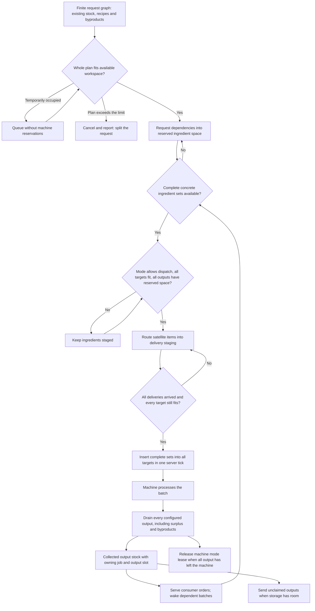

# Pattern crafting batch execution

The request graph still owns promises and ingredient claims through stable branch references. A separate child
reference identifies each producing batch. Consumer orders may finish before that batch has finished producing;
the batch retains its recipe snapshot, output locations, and remaining quantities until all outputs are accounted for.

## Admission and limits

Admission conservatively reserves **all** recipe input and output quantities in the finite dependency plan, rather
than calculating an optimal peak-memory schedule. All participating pipes are checked before any reservations change.
This permits ingredient gathering for waiting parents without taking machine leases or consuming a child's workspace.
Reservations persist across restarts and remain until the job's orders, ingredients, and producing batches have drained.

Each pipe has separate input and output budgets of **65,536 items** and **16,000,000 mB**. Batches contain at most
**64 whole sets**, and at most **1,024 batch records** are retained per pipe. A plan larger than its workspace limit
is rejected, even when an incremental schedule might fit; splitting the request is the supported alternative.

Temporary output stock remains owned by its admitted job. Recipes may use byproduct promises within the original
request graph. Ingredient planning for a different job uses storage instead of promising another job's temporary
output stock, so a queued job cannot pin the workspace of the job it is waiting behind. A direct request for an
existing extra can still consume it immediately.

## Mode policy

| Mode | Additional batch admission at shared targets |
| --- | --- |
| Blocking | Wait until the previous batch's entire configured output has been drained. |
| Smart Blocking | Allow the same concrete recipe when another complete set fits. |
| Non blocking | Allow different recipes when complete sets fit; the machine must support mixing them. |

Target checks include physical input inventories/tanks and configured output inventories/tanks across loaded pattern
pipes. Recipe comparison uses concrete ingredients per set and configured outputs, rather than pattern-slot numbers,
satellite names, or main-output selection. A batch awaiting satellite deliveries exclusively holds its targets in every
mode; running Non blocking batches still retain their output accounting.

## Persistence and recovery

NBT records keep workspace reservations, batch IDs, recipe snapshots, output targets, and each output's amounts still
in the machine, in transit, collected, or awaiting replacement after transport loss. Satellite delivery staging and
pending dispatch progress are also saved. Cancellation retains committed batches and drains their output to storage;
uncommitted satellite deliveries are returned. The request monitor exposes batches after consumer orders disappear.

Orders from saves predating batch execution finish through the existing order extraction path. New jobs wait for those
orders to drain, preventing new batch accounting from consuming outputs that belong to old serialized orders.

## Adapter boundary

The LP pattern table supports atomic whole-set insertion. Generic item/fluid handlers only support simulation followed
by insertion. Their capacities are checked together and checked again after routed deliveries arrive; insertion happens
without yielding the server thread. An adapter that inserts less than it simulated retains exact progress for recovery.
Strict atomicity cannot be guaranteed for third-party handlers that misreport capacity or process recipes during insertion.

Separate hatches belonging to one multiblock are recognized as shared only when their configured physical input or
output targets overlap. Generic inventory APIs do not expose a common multiblock-controller identity. Full external
storage, stopped machines, unloaded targets, and incompatible Non blocking machine recipes can pause progress;
these are outside the scheduler's workspace guarantee.
