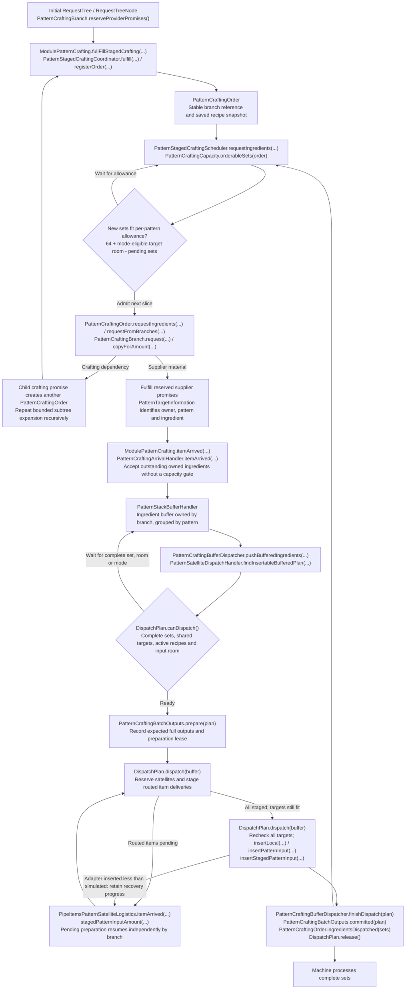
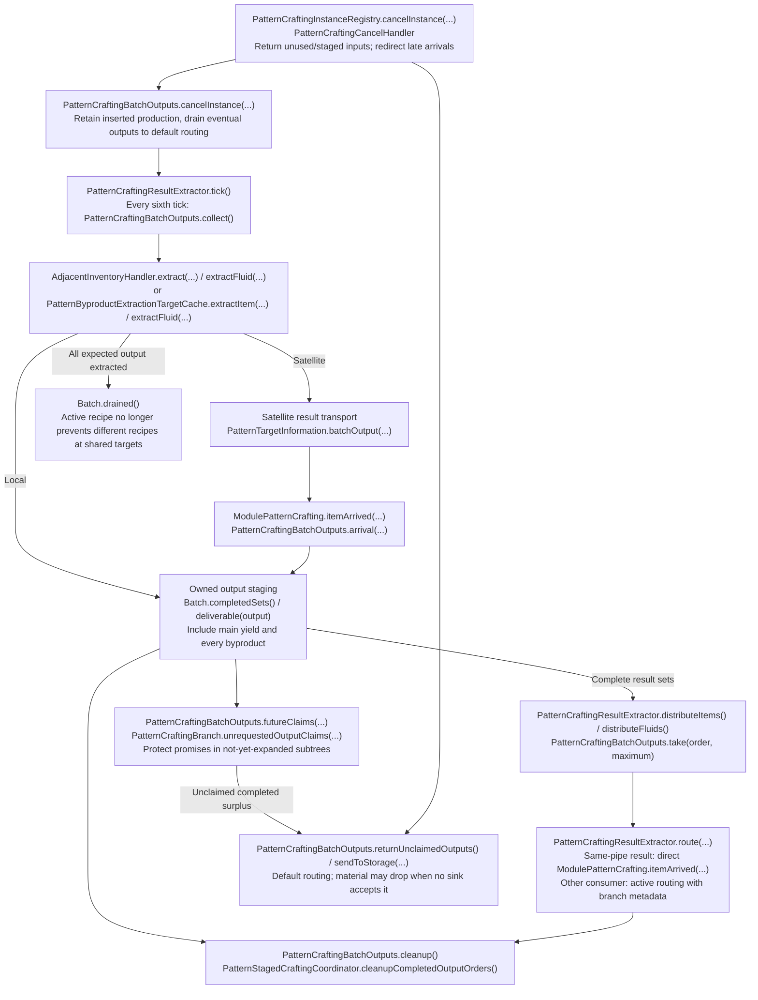

# Current pattern crafting process

All runtime classes shown below are in `src/main/java/logisticspipes/crafting/`. Arrows describe execution or
asynchronous data flow; they do not imply that every method directly calls the next method.

## Planning, ordering, and insertion

Blocking and Smart Blocking both permit additional complete sets of the active recipe; they differ in ordering
allowance. Non blocking permits different recipes when targets fit. Prepared batches hold their shared targets
exclusively until commit. Shared item inventories and overlapping fluid tank handlers are simulated together to
avoid spending the same physical room twice.

## Extraction, distribution, and cancellation

Physical output collection may be partial to avoid filling a small byproduct hatch. Consumers can take output only
from complete result sets. Main-output overproduction remains tracked even if the original requested amount is
smaller than the recipe yield. Cancellation routes collected output immediately and keeps polling inserted production.

## Tick and restart

`ModulePatternCrafting.tick()` restores staged orders, retries deferred satellite cleanup, waits for unresolved
restoration, validates fluid support, retries lost deliveries, extracts/distributes results, resumes/inserts buffered
sets, then schedules additional ingredient subtrees. Output draining precedes further insertion.

NBT persists the flat branch graph and order references through `PatternStagedCraftingCoordinator`, recipe snapshots
and quantities through `PatternCraftingOrder`, buffers/requests through `PatternStackBufferHandler` and
`PatternStackRequestHandler`, production through `PatternCraftingBatchOutputs`, and independent pending dispatches
through `PatternCraftingBufferDispatcher`. Satellites persist their delivery staging and preparation reservation.

`ModulePatternCrafting.itemLost(...)`, `PatternCraftingBatchOutputs.lost(...)`, and
`PatternLostIngredientHandler.retryLostItems()` reconcile lost output/ingredient delivery. Satellite staging retries
lost ingredient packets through `PipeItemsPatternSatelliteLogistics.throttledUpdateEntity()`.

The small legacy extraction path handles older orders saved before batch accounting. Generic machine APIs still
require reliable simulation/insertion; an unexpectedly short insertion preserves exact recovery progress.

See [the implemented design](pattern-crafting-simplified-design.md) and [the complete source map](pattern-crafting-code-map.md).
