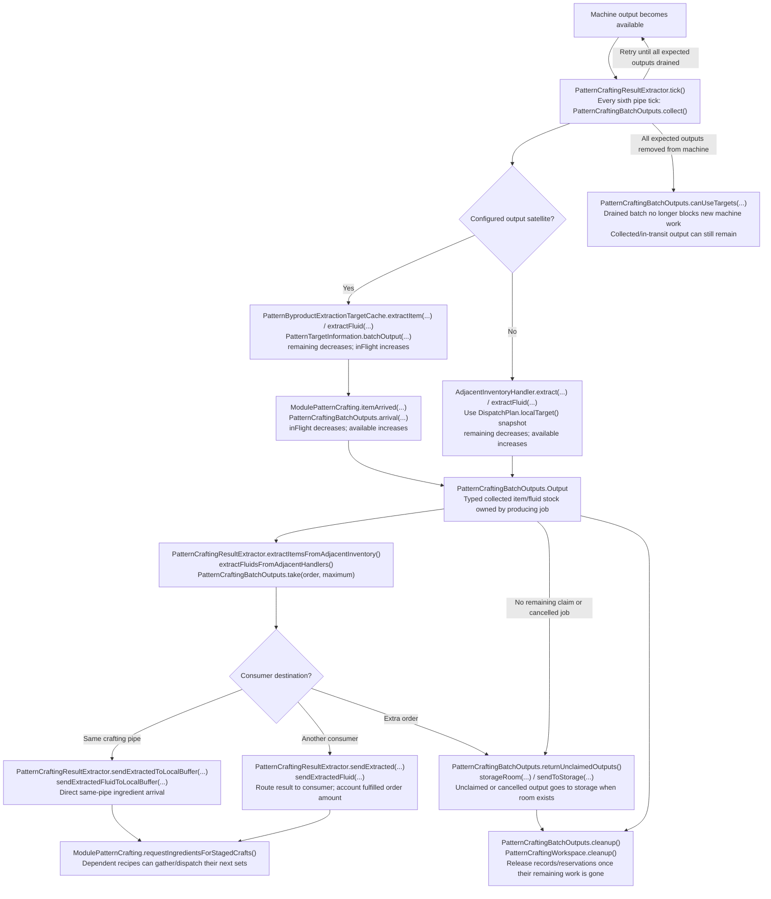

# Current pattern crafting process

Implementation reference: `bf5fe60d`. All classes below are in
`src/main/java/logisticspipes/crafting/`. Labels use actual class and method names;
arrows describe control flow or asynchronous data flow, rather than implying that
every connected method directly calls the next method. This covers pattern crafting,
including its satellite pipes, rather than the older non-pattern crafting pipe.

## Request, ingredient staging, and machine insertion

```mermaid
flowchart TD
    Request["ModulePatternCrafting.fullFillStagedCrafting(...)"]
    Register["PatternStagedCraftingCoordinator.fulfill(...)<br/>Create/register PatternCraftingOrder and its branch graph"]
    Schedule["PatternStagedCraftingCoordinator.requestIngredients()<br/>PatternStagedCraftingScheduler.requestIngredients(...)"]
    Select["PatternStagedCraftingScheduler.requestOrderIngredients(...)"]
    Admit{"PatternCraftingWorkspace.admit(order)<br/>PatternCraftingBranch.collectWorkspace(plan)"}
    Queue["Wait for workspace or legacy orders to drain<br/>Retry from a later scheduler invocation"]
    Reject["PatternCraftingInstanceRegistry.cancelInstance(...)<br/>Plan exceeds hard workspace limits: split request"]
    Ingredients["PatternCraftingOrder.requestIngredients(pattern, sets)<br/>PatternCraftingOrder.requestFromBranches(...)<br/>Fulfill reserved stock/crafting promises"]
    Child["ModulePatternCrafting.fullFillStagedCrafting(...)<br/>Child recipe order in the same job"]
    Arrival["ModulePatternCrafting.itemArrived(...)<br/>PatternCraftingArrivalHandler.itemArrived(...)<br/>solidItemArrived(...) / fluidArrived(...)"]
    Buffer["PatternStackBufferHandler<br/>Ingredient stock keyed by owning branch"]
    Push["PatternCraftingBufferDispatcher.pushBufferedIngredients()<br/>pushBufferedIngredientsFor(...)"]
    Sets{"PatternCraftingBufferDispatcher.completeBufferedSets(...)<br/>Complete concrete ingredient sets available?"}
    Plan["PatternSatelliteDispatchHandler.findInsertableBufferedPlan(...)<br/>At most 64 complete sets"]
    Check{"PatternSatelliteDispatchHandler.DispatchPlan.canDispatch()<br/>Targets available, mode compatible, complete sets fit?"}
    Prepare{"PatternCraftingBatchOutputs.prepare(plan)<br/>canUseTargets(plan)<br/>Reserve every configured output and shared-target lease"}
    Dispatch["PatternSatelliteDispatchHandler.DispatchPlan.dispatch(buffer)<br/>Reserve input satellites; resolve target snapshots"]
    Stage["DispatchPlan.routeItemSatelliteAssignment(...)<br/>PipeItemsPatternSatelliteLogistics.itemArrived(...)<br/>Stage routed items outside the machine inventory"]
    Ready{"DispatchPlan.dispatch(buffer)<br/>stagedPatternInputAmount(...) sufficient?<br/>canDispatch() still succeeds?"}
    Insert["DispatchPlan.insertLocal(buffer)<br/>PipeFluidPatternSatelliteLogistics.insertPatternInput(...)<br/>PipeItemsPatternSatelliteLogistics.insertStagedPatternInput(...)<br/>or insertPatternInput(...) for instant satellite items"]
    Complete{"DispatchResult.COMPLETE?"}
    Pending["PatternCraftingBufferDispatcher.pendingDispatch<br/>resumePendingDispatch()<br/>Retain exact progress across ticks/restarts"]
    Finish["PatternCraftingBufferDispatcher.finishDispatch(plan)<br/>PatternCraftingBatchOutputs.committed(plan)<br/>DispatchPlan.release()<br/>PatternCraftingOrder.ingredientsDispatched(sets)"]
    Machine["Connected machine processes complete ingredient sets"]

    Request --> Register --> Schedule --> Select --> Admit
    Admit -->|Temporarily occupied| Queue --> Schedule
    Admit -->|Plan too large| Reject
    Admit -->|Reserved on every participating pipe| Ingredients
    Ingredients -->|Crafting promise| Child --> Register
    Ingredients -->|Stock/provider delivery| Arrival --> Buffer --> Push --> Sets
    Sets -->|No: wait for more deliveries| Buffer
    Sets -->|Yes| Plan --> Check
    Check -->|No: retry later| Push
    Check -->|Yes| Prepare
    Prepare -->|No room or conflicting lease| Push
    Prepare -->|Prepared| Dispatch
    Dispatch -->|Routed satellite items| Stage --> Ready
    Dispatch -->|Local, fluid, or instant item inputs| Ready
    Ready -->|Waiting for delivery or capacity| Pending
    Ready -->|All ready| Insert --> Complete
    Complete -->|Unexpected short insertion| Pending --> Dispatch
    Complete -->|Yes| Finish --> Machine
```



`DispatchResult.NONE` discards an uncommitted prepared batch through
`PatternCraftingBatchOutputs.discardPrepared(...)`; `PARTIAL` retains a pending
dispatch. Normal routed item deliveries wait in satellite staging before any
machine insertion. Generic handlers are simulated together, then inserted serially
in the same server tick; handlers that insert less than simulated require recovery.

## Producing batch, consumer delivery, and surplus



Collection drains the **full configured recipe output**, including partial-request
overflow and byproducts, independently of how much the consumer ordered. A batch
order without collected stock waits; it does not fall back to extracting arbitrary
physical output. `PatternCraftingBatchOutputs.manages(order)` selects that path.
Older saved orders with `PatternCraftingOrder.usesBatchExecution() == false` retain
the legacy per-order extraction path.

`PatternCraftingBatchOutputs.canUseTargets(...)` applies Blocking until the prior
batch is drained, Smart Blocking for matching concrete recipes, and Non blocking
for any compatible complete recipe that fits. An uncommitted preparation holds its
shared targets exclusively in every mode. Physical input/output target overlap is
used for sharing; separate hatches do not establish a common controller identity.

## Actual server tick order

```mermaid
flowchart TD
    Tick["ModulePatternCrafting.tick()"]
    Restore["restoreStagedCraftingIfNeeded()<br/>PatternStagedCraftingCoordinator.restoreFromNBT(...)"]
    Deferred["PatternCraftingBufferDispatcher.retryDeferredCleanup()"]
    Gate{"pendingStagedCrafting != null?"}
    Return["Return; wait for restored dependencies"]
    Validate["cancelUnsupportedFluidPatternCrafts()<br/>scheduleRequestedIngredientRestoreRetriesIfReady()"]
    Retry["PatternLostIngredientHandler.retryLostItems()"]
    Results["PatternCraftingResultExtractor.tick()<br/>collect; serve item/fluid orders;<br/>returnUnclaimedOutputs; cleanup"]
    Push["ModulePatternCrafting.pushBufferedIngredients()<br/>PatternCraftingBufferDispatcher.pushBufferedIngredients()"]
    Request["PatternStagedCraftingCoordinator.requestIngredients()"]
    Legacy["ModulePatternCrafting.clearRunningCraftIfFinished()"]
    Cleanup["PatternCraftingWorkspace.cleanup()"]
    Tick --> Restore --> Deferred --> Gate
    Gate -->|Yes| Return
